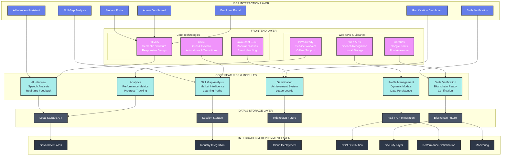

# PRAGATI-AI Architecture Diagram

## Mermaid Diagram Source Code

You can copy and paste this code into any Mermaid editor like:
- https://mermaid.live/
- https://mermaid-js.github.io/mermaid-live-editor/
- GitHub markdown files
- Notion, Obsidian, or other documentation tools



## Technology Stack Overview

### Frontend Technologies 🎨
- **HTML5**: Semantic elements, responsive design, accessibility
- **CSS3**: Grid & Flexbox layouts, animations, custom properties
- **JavaScript ES6+**: Modular architecture, async/await, classes

### Web APIs & Integration ⚙️
- **Web Speech API**: Voice recognition and synthesis
- **Local Storage API**: Client-side data persistence
- **Modern Web Standards**: PWA, Service Workers

### Core Features 🚀
- **AI Interview Assistant**: Real-time speech analysis and feedback
- **Skill Gap Analysis**: Market intelligence and personalized learning
- **Gamification**: Achievement system and progress tracking
- **Dynamic UI**: Interactive modals and responsive design

### Architecture Principles 🛡️
- **Modular Design**: Separation of concerns, reusable components
- **Performance**: Optimized loading, smooth animations
- **Security**: Input validation, safe DOM handling
- **Scalability**: Ready for backend integration

### Future Roadmap 📱
- **Progressive Web App**: Full offline functionality
- **Blockchain Integration**: Secure skills verification
- **AI/ML Models**: Advanced analysis and predictions
- **Government APIs**: Compliance and integration

## Data Flow

```
User Interaction → Frontend Processing → Feature Execution → Data Management → Results
```

1. **User Entry**: Students access portal and select features
2. **Frontend Processing**: HTML/CSS/JS handle UI and interactions  
3. **Feature Execution**: AI analysis, skill assessment, gamification
4. **Data Management**: Local storage, session management, persistence
5. **Results & Growth**: Performance metrics, recommendations, progress

## Smart India Hackathon 2024 Focus

✅ **Innovation**: AI-powered interview and skill analysis
✅ **Technical Excellence**: Modern web technologies and clean architecture  
✅ **Scalability**: Modular design ready for government deployment
✅ **User Experience**: Intuitive, responsive, and accessible design
✅ **Government Compliance**: Ready for integration with official systems