# PRAGATI-AI - System Architecture Wireframe

## Clean Wireframe Style Architecture Diagram

### Mermaid Diagram Code
Copy this code into any Mermaid editor for a professional wireframe visualization:

```mermaid
graph TB
    %% Define User Layer
    User["👤 User<br/>Students & Admin"]
    HW["🔧 Hardware Sensors<br/>Microphone, Camera"]

    %% Frontend Layer
    subgraph "🎨 FRONTEND LAYER"
        SP["Student Portal<br/>HTML5, CSS3, JS ES6+"]
        WA["Web Application<br/>PWA, Responsive UI"]  
        AD["Admin Dashboard<br/>Management Interface"]
    end

    %% AI Pipeline
    subgraph "🤖 AI PIPELINE"
        SPEECH["Speech Processing<br/>Web Speech API"]
        NLP["NLP Analysis<br/>Text Processing"]
        SKILL["Skill Assessment<br/>Gap Analysis"]
        FEEDBACK["Feedback Engine<br/>Real-time Response"]
        PERF["Performance AI<br/>Prediction Models"]
    end

    %% Backend Services
    subgraph "⚙️ BACKEND SERVICES"
        API["API Gateway<br/>RESTful Services"]
        AUTH["Authentication<br/>JWT Security"]
        ANALYTICS["Analytics Engine<br/>Performance Tracking"]
        GAMIFY["Gamification<br/>Badges & Rewards"]
        NOTIFY["Notifications<br/>Real-time Alerts"]
    end

    %% Data Storage
    subgraph "💾 DATA STORAGE"
        MONGO[("MongoDB<br/>Primary Database")]
        REDIS[("Redis Cache<br/>Fast Storage")]
        FILES[("File Storage<br/>Media Assets")]
    end

    %% External Services
    EXT["🌐 External APIs<br/>Government Integration"]

    %% Connections
    User --> SP
    User --> AD
    HW -.-> SPEECH
    
    SP --> API
    WA --> API  
    AD --> API

    SPEECH --> NLP
    NLP --> SKILL
    SKILL --> FEEDBACK
    FEEDBACK --> PERF

    SPEECH --> API
    NLP --> API
    SKILL --> API
    FEEDBACK --> API
    PERF --> API

    API --> AUTH
    API --> ANALYTICS
    API --> GAMIFY
    API --> NOTIFY

    AUTH --> MONGO
    ANALYTICS --> MONGO
    GAMIFY --> MONGO
    NOTIFY --> REDIS

    MONGO --> EXT
    REDIS --> EXT
    FILES --> EXT

    %% Styling for clean wireframe look
    classDef userStyle fill:#e8d5ff,stroke:#9b59b6,stroke-width:2px,color:#8e44ad
    classDef frontendStyle fill:#d6eaf8,stroke:#3498db,stroke-width:2px,color:#2980b9
    classDef aiStyle fill:#d5f4e6,stroke:#27ae60,stroke-width:2px,color:#229954
    classDef backendStyle fill:#fdeaa7,stroke:#f39c12,stroke-width:2px,color:#e67e22
    classDef storageStyle fill:#e8daef,stroke:#8e44ad,stroke-width:2px,color:#7d3c98
    classDef externalStyle fill:#d5d8dc,stroke:#7f8c8d,stroke-width:2px,color:#566573
    classDef hwStyle fill:#fff9e6,stroke:#f1c40f,stroke-width:2px,color:#d68910

    class User userStyle
    class HW hwStyle
    class SP,WA,AD frontendStyle
    class SPEECH,NLP,SKILL,FEEDBACK,PERF aiStyle
    class API,AUTH,ANALYTICS,GAMIFY,NOTIFY backendStyle
    class MONGO,REDIS,FILES storageStyle
    class EXT externalStyle
```



## System Components Overview

### 🎯 **User Interface Layer**
- **User**: Students, admins, and employers
- **Hardware Sensors**: Microphone and camera for real-time input

### 🎨 **Frontend Layer** 
- **Student Portal**: Main interface built with HTML5, CSS3, JavaScript ES6+
- **Web Application**: Progressive Web App with responsive design
- **Admin Dashboard**: Management and monitoring interface

### 🤖 **AI Processing Pipeline**
- **Speech Processing**: Web Speech API integration
- **NLP Analysis**: Natural language processing for text analysis
- **Skill Assessment**: Automated skill gap analysis 
- **Feedback Engine**: Real-time response generation
- **Performance AI**: Predictive analytics and recommendations

### ⚙️ **Backend Services**
- **API Gateway**: RESTful API management and routing
- **Authentication**: JWT-based security system
- **Analytics Engine**: Performance tracking and metrics
- **Gamification**: Achievement system with badges and rewards
- **Notifications**: Real-time alert system

### 💾 **Data Storage**
- **MongoDB**: Primary database for user data and analytics
- **Redis Cache**: High-speed caching for optimal performance
- **File Storage**: Cloud storage for media assets and documents

### 🌐 **External Integration**
- **Government APIs**: Integration with official systems
- **Third-party Services**: External data sources and validation

## Data Flow Architecture

```
📱 User Input → 🎨 Frontend → 🤖 AI Processing → ⚙️ Backend → 💾 Storage → 🌐 External APIs
```

### Processing Pipeline:

1. **Input Capture**: Users interact through the portal, hardware sensors capture audio/video
2. **Frontend Processing**: HTML/CSS/JS handle UI interactions and data formatting
3. **AI Analysis**: Speech recognition, NLP, and skill assessment processes
4. **Backend Logic**: API routing, authentication, analytics, and gamification
5. **Data Persistence**: MongoDB stores data, Redis caches frequently accessed information
6. **External Integration**: Government APIs and third-party services for validation

## Technical Specifications

| Layer | Technologies | Purpose |
|-------|-------------|---------|
| **Frontend** | HTML5, CSS3, JavaScript ES6+, PWA | User interface and interaction |
| **AI Pipeline** | Web Speech API, NLP libraries | Intelligent processing and analysis |
| **Backend** | RESTful APIs, JWT, Node.js | Business logic and data management |
| **Storage** | MongoDB, Redis, Cloud Storage | Data persistence and caching |
| **Integration** | Government APIs, WebSocket | External connectivity and real-time updates |

## Security & Performance Features

### 🛡️ **Security**
- JWT-based authentication
- Input validation and sanitization  
- Secure API endpoints
- Data encryption at rest and in transit

### ⚡ **Performance**
- Redis caching for fast data retrieval
- CDN for static asset delivery
- Optimized database queries
- Progressive Web App for offline functionality

### 📊 **Scalability**
- Microservices architecture
- Load balancing capabilities
- Horizontal scaling support
- Cloud-native deployment ready

## Smart India Hackathon 2024 Alignment

✅ **Innovation**: AI-powered interview assistance and skill analysis
✅ **Technical Excellence**: Modern web technologies and clean architecture
✅ **Government Ready**: API integration capabilities for official systems
✅ **Scalability**: Designed for nationwide deployment
✅ **User Experience**: Intuitive design with accessibility features
✅ **Performance**: Optimized for high concurrent usage
✅ **Security**: Enterprise-grade security implementation